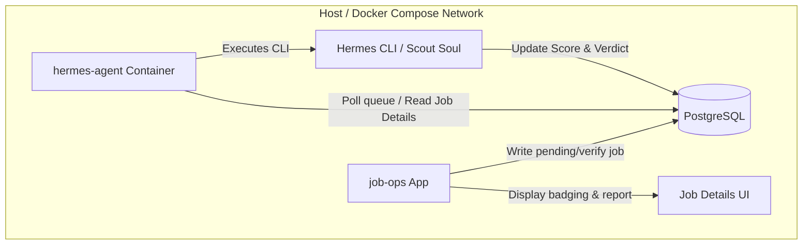

# Implementation Plan - Hermes Agent Job Verification Integration (Docker Compose Mode)

This plan outlines the design and steps to integrate the Hermes Agent-based job-verification system ("RealJob Scout") as a containerized service managed by Docker Compose. The system is designed for both local development and direct production deployment on Digital Ocean.

## User Decisions Integrated
- **Docker Compose Orchestration**: The Hermes agent will be run as a containerized service defined in the root `docker-compose.yml`.
- **In-Container Execution**: The agent will run fully inside its own container using an installed `hermes` command-line binary.
- **Asynchronous Background Processing**: Job verification is handled asynchronously by a background polling worker running in the Hermes Agent container.

---

## Proposed Architecture & Components



---

## Proposed Changes

### 1. Database Schema Extension

#### [MODIFY] [schema.ts](file:///home/s4developer/engineering-projects/job-ops-migration/orchestrator/src/server/db/schema.ts)
- Add verification fields to the `jobs` table:
  - `verificationStatus`: text enum (`unverified`, `verifying`, `completed`, `failed`) with default `unverified`.
  - `verificationVerdict`: text enum (`likely_real`, `needs_verification`, `possible_ghost`, `likely_scam`, `insufficient_evidence`).
  - `verificationScore`: integer (0 to 100).
  - `verificationPriority`: text enum (`high`, `medium`, `low`, `do_not_apply`).
  - `verificationDetails`: jsonb block storing parsed evidence lists, flags, missing information, and recommended actions.
  - `verificationOutreachMessage`: text (suggested recruiter/hiring manager introduction template).
  - `verificationRunAt`: timestamp.

---

### 2. Hermes Agent Workspace Project

We will build the Hermes Agent integration inside `apps/hermes-agent`.

#### [NEW] [project.json](file:///home/s4developer/engineering-projects/job-ops-migration/apps/hermes-agent/project.json)
- Define targets for standard workspace checks (`lint`, `typecheck`, `test`) and `build`.

#### [NEW] [package.json](file:///home/s4developer/engineering-projects/job-ops-migration/apps/hermes-agent/package.json)
- Add ESM module dependencies, standard typescript packages, and references to database connections.

#### [NEW] Config Templates (inside `apps/hermes-agent/config/`)
- `config.yaml`: Setup for Docker/local terminal backend, Tavily search, and Firecrawl extraction.
- `SOUL.md`: Persona and system prompt for the **RealJob Scout** agent.
- `skills/job-verification/SKILL.md`: The 100-point scoring algorithm and workflow for triaging jobs.
- `data/trusted_ats_domains.txt` & `data/scam_patterns.txt`: Keywords and domains used by the agent during verification steps.

#### [NEW] Polling Worker CLI (inside `apps/hermes-agent/src/worker.ts`)
- Script that runs as the container command:
  1. Polls the shared PostgreSQL database for jobs with `verificationStatus = 'unverified'` or manually requested triggers (`verifying`).
  2. Spawns `hermes run --skill job-verification` for the target job's metadata.
  3. Parses the output JSON/Markdown from the execution session.
  4. Writes results back to the database and marks status as `completed` or `failed`.

#### [NEW] [Dockerfile](file:///home/s4developer/engineering-projects/job-ops-migration/apps/hermes-agent/Dockerfile)
- Builds the `hermes-agent` image:
  - Base image: Node/Python parent image.
  - Install python3, git, and `hermes` CLI (`curl -fsSL https://hermes-agent.nousresearch.com/install.sh | bash`).
  - Pre-configure the `/root/.hermes` home by copying `config/config.yaml`, `config/SOUL.md`, and the `job-verification` skill folders.
  - Expose workspace files and define default command: `pnpm tsx src/worker.ts`.

---

### 3. Docker Compose Orchestration

#### [MODIFY] [docker-compose.yml](file:///home/s4developer/engineering-projects/job-ops-migration/docker-compose.yml)
- Add a new service definition `hermes-agent`:
  ```yaml
    hermes-agent:
      build:
        context: .
        dockerfile: apps/hermes-agent/Dockerfile
      container_name: hermes-agent
      depends_on:
        - job-ops
      environment:
        - DATABASE_URL=${DATABASE_URL}
        - OPENROUTER_API_KEY=${OPENROUTER_API_KEY}
        - TAVILY_API_KEY=${TAVILY_API_KEY}
        - FIRECRAWL_API_KEY=${FIRECRAWL_API_KEY}
      env_file:
        - .env
      restart: unless-stopped
  ```

---

### 4. Orchestrator Integration (API & UI)

#### [NEW] [verification.ts](file:///home/s4developer/engineering-projects/job-ops-migration/orchestrator/src/server/api/routes/jobs/verification.ts)
- Add REST/Express endpoints:
  - `POST /api/jobs/:id/verify`: Reset verification status to `unverified` (or `verifying`) to trigger a background worker pass.

#### [MODIFY] [routes.ts](file:///home/s4developer/engineering-projects/job-ops-migration/orchestrator/src/server/api/routes.ts)
- Register the verification route.

#### [NEW] [VerificationCard.tsx](file:///home/s4developer/engineering-projects/job-ops-migration/orchestrator/src/client/components/job/VerificationCard.tsx)
- React panel displaying status badging, 0-100 radial/linear meter, lists of evidence and red flags, suggested outreach messages, and a "Verify Now" CTA.

#### [MODIFY] [JobDetails.tsx](file:///home/s4developer/engineering-projects/job-ops-migration/orchestrator/src/client/pages/job/JobDetails.tsx)
- Embed `VerificationCard` into the side panel of the job details dashboard.

---

## Verification Plan

### Automated Tests
- Database update verification using `@electric-sql/pglite` in `apps/hermes-agent/src/worker.test.ts`.
- Check JSON output parser logic against stubbed Hermes responses.

### Manual Verification
- Deploy using `docker compose up --build`.
- Trigger verification for a test job in the web client interface.
- Observe container logs (`docker logs hermes-agent`) to monitor execution of the Hermes verification workflow.
